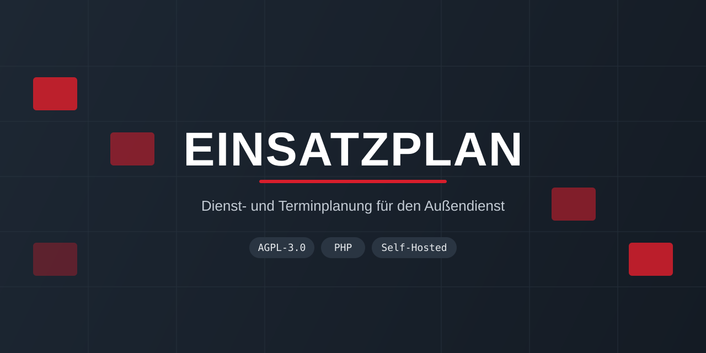
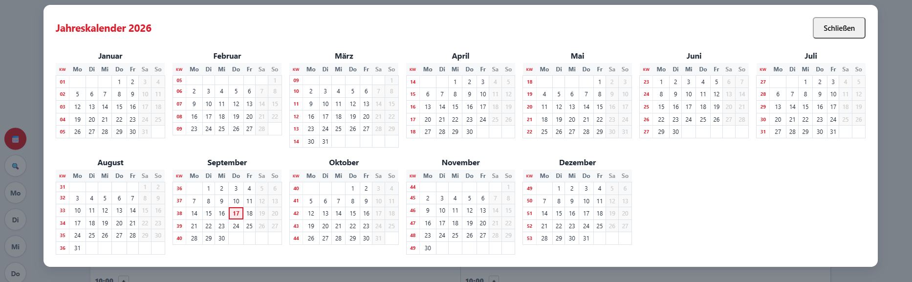
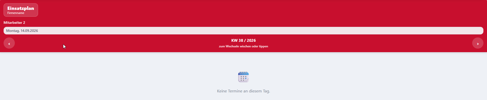
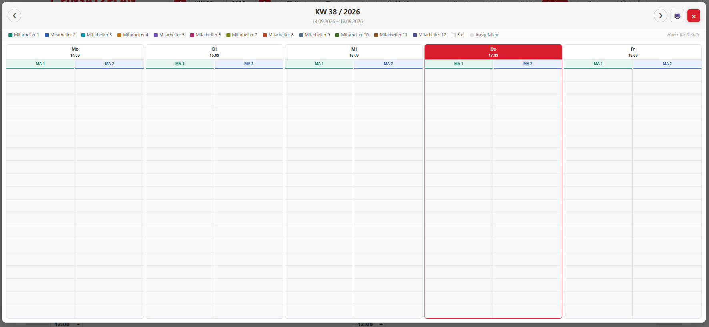
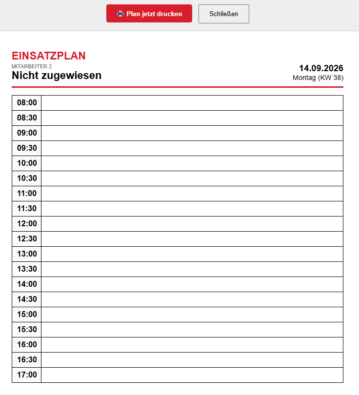
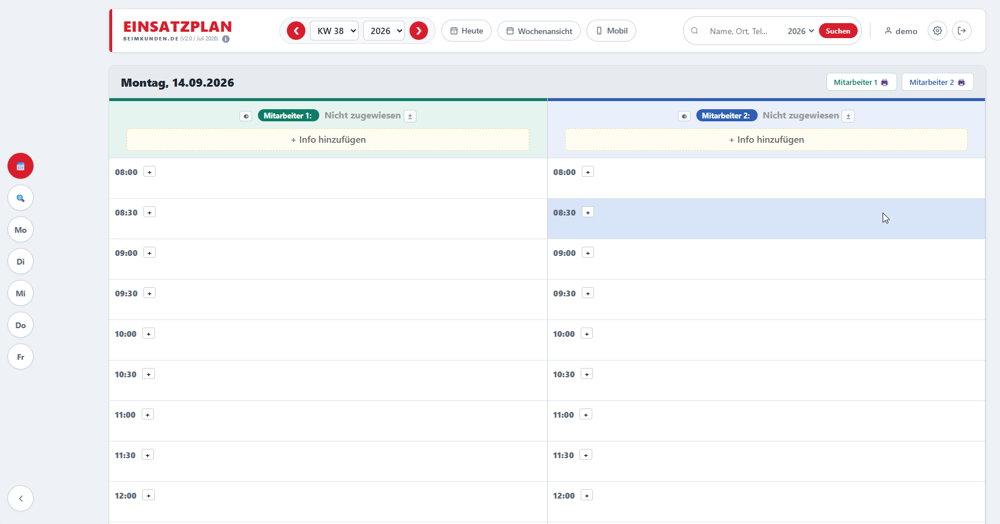
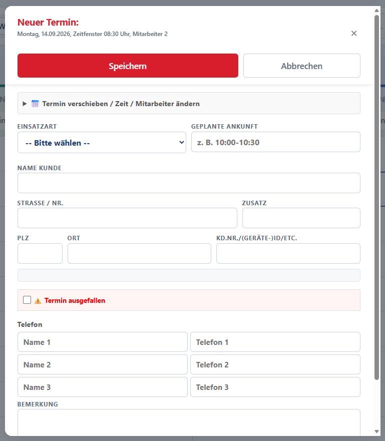

  

  
  
  
  

# Einsatzplan

Web-basierte Dienst-/Terminplanung für den Außendienst (z. B. Pflegedienste,
Handwerksbetriebe, technische Dienste). Verwaltet Termine je Mitarbeiter und
Wochentag, bietet eine mobile Ansicht für Mitarbeiter unterwegs, Druckansichten,
PLZ-Autovervollständigung und einen Admin-Bereich zur Konfiguration.

Früher als kommerzielle Software vertrieben, seit diesem Repository freie
Software unter der **GNU AGPL-3.0** – siehe [`LICENSE`](LICENSE).

## Inhalt

- [Funktionen](#funktionen)
- [Screenshots](#screenshots)
- [Voraussetzungen](#voraussetzungen)
- [Installation](#installation)
- [Eigenes Impressum](#eigenes-impressum)
- [Lizenz](#lizenz)
- [Beitragen](#beitragen)
- [Sicherheit](#sicherheit)

## Funktionen

- Wochenansicht mit frei konfigurierbarer Mitarbeiteranzahl pro Wochentag
- Mobile Ansicht (PWA-fähig) für Mitarbeiter im Außendienst
- Rollen: Admin / Benutzer / Betrachter
- Terminverwaltung inkl. Vertretungen, Notizen, Druckansichten
- PLZ-/Ortsvorschläge auf Basis eines mitgelieferten deutschen Verzeichnisses
- Läuft auf SQLite (Zero-Config) oder MySQL

## Screenshots

| Tagesansicht | Wochenübersicht |
|---|---|
|  |  |

| Mobile Ansicht | Neuer Termin |
|---|---|
|  |  |

| Jahreskalender | Druckansicht |
|---|---|
|  |  |

## Voraussetzungen

- PHP 8.1 oder neuer, mit den Erweiterungen `pdo_sqlite` (Standard) bzw.
  `pdo_mysql` (optional, für MySQL-Betrieb)
- Ein Webserver mit PHP-Unterstützung (Apache, nginx+PHP-FPM, o. ä.)
- Kein externer Lizenzserver, keine Internetverbindung zur Laufzeit nötig

## Installation

1. Repository auf den Webspace kopieren.
2. `install.php` im Browser aufrufen (z. B. `https://dein-server.de/install.php`)
   – der geführte Installer prüft die Systemvoraussetzungen, richtet die
   Datenbank ein und legt das erste Admin-Konto an.
3. Nach Abschluss der Installation **`install.php` vom Server löschen**
   (der Installer weist selbst noch einmal darauf hin).
4. Fertig – unter `login.php` anmelden.

Für MySQL statt SQLite: `mysql_setup.php` vor oder anstelle von `install.php`
aufrufen; Details siehe Kommentare in der Datei.

## Eigenes Impressum

`impressum.php` enthält nur einen Platzhalter. Jeder Betreiber ist gesetzlich
verpflichtet (z. B. § 5 DDG in Deutschland), dort seine eigenen Firmen-/
Kontaktdaten einzutragen – siehe Hinweis direkt auf der Seite.

## Lizenz

Dieses Projekt steht unter der **GNU Affero General Public License v3.0**
(AGPL-3.0) – siehe [`LICENSE`](LICENSE). Kurz zusammengefasst: Du darfst die
Software frei nutzen, verändern und weitergeben. Bietest du eine veränderte
Version öffentlich über ein Netzwerk an (z. B. als gehosteten Dienst für
Dritte), musst du den veränderten Quellcode ebenfalls unter der AGPL-3.0
bereitstellen.

Enthaltene Drittanbieter-Komponenten (QRCode.js, PLZ-Verzeichnis) mit eigenen
Lizenzbedingungen sind in [`NOTICE.md`](NOTICE.md) aufgeführt.

## Beitragen

Issues und Pull Requests sind willkommen – siehe [`CONTRIBUTING.md`](CONTRIBUTING.md)
für Details.

## Sicherheit

Wird eine Sicherheitslücke gefunden, bitte nicht als öffentliches Issue
melden, sondern den Maintainer direkt kontaktieren (Kontakt siehe Info-Bereich
der Anwendung bzw. Profil dieses Repositories).
